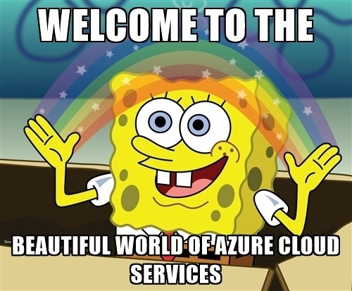

# **QuickAZ** 

> QuickAZ, find (Maybe) attack surfaces (Azure) 🚩🐍



```console
Usage: quickaz.py [OPTIONS] HOSTNAME [PERMUTATION_WORDLIST_PATH] [BRUTE_BLOB]
                  [PATHS_WORDLIST_PATH] [REGIONS_WORDLIST_PATH] [EMAILS]
                  [OUTPUT] [ENUM_MAILS] [GEN_EMAILS] [FIRST_NAMES]
                  [LAST_NAMES] [THREADS]

Arguments:
  HOSTNAME                     Target hostname example.com  [required]
  [PERMUTATION_WORDLIST_PATH]  Wordlist with common names to permute while
                               brute force blobs and others services
                               [default: wordlists/permutation.txt]
  [BRUTE_BLOB]                 Enable brute force blobs  [default: False]
  [PATHS_WORDLIST_PATH]        Wordlist with common paths to discover open
                               containers  [default: wordlists/paths.txt]
  [REGIONS_WORDLIST_PATH]      Wordlist with common regions to discover
                               cloudpass  [default: wordlists/regions.txt]
  [EMAILS]                     Wordlist with emails to enumerate
  [OUTPUT]                     Output folder  [default: output]
  [ENUM_MAILS]                 Enable enumerate emails from wordlist provided
                               or from email generator  [default: False]
  [GEN_EMAILS]                 Email pattern to generate emails based on
                               schemas: foo.bar@example.com or
                               fbar@example.com
  [FIRST_NAMES]                Wordlist with firstnames to generate with
                               gen_emails flag  [default:
                               wordlists/names/brazil_firstnames.txt]
  [LAST_NAMES]                 Wordlist with surname to generate with
                               gen_emails flag  [default:
                               wordlists/names/brazil_secondname.txt]
  [THREADS]                    Threads while enumerate emails > 2 maybe you
                               get false positives  [default: 2]

Options:
  --verbose / --no-verbose        [default: no-verbose]
  --install-completion [bash|zsh|fish|powershell|pwsh]
                                  Install completion for the specified shell.
  --show-completion [bash|zsh|fish|powershell|pwsh]
                                  Show completion for the specified shell, to
                                  copy it or customize the installation.
  --help                          Show this message and exit.

```
#### Features
- [x] Enumerate tenant
- [x] Enumerate users from a given hostname
- [x] Realm finder
- [x] Proxy Support
- [x] OpenID
- [x] Container finder
- [x] Storage finder
- [x] Find Tenant names
- [x] Find OneDrive Urls 
- [x] Finding open queue,dfs,files,web
- [x] Enumerate mail users o365
  - [x] Given wordlist
  - [x] Schema generator

##### Useful google dorks
```

GitHub:
  "#EXT#" AND onmicrosoft.com AND <target> lang:Shell OR lang:PowerShell 
  "https://" AND "blob.core.windows.net/newcontainer" AND sig
```

```console
<company-name>.blob.core.windows.net
<company-name>cloud.blob.core.windows.net
<company-name>images.blob.core.windows.net
<company-name>backup.blob.core.windows.net
<company-name>backups.blob.core.windows.net
<company-name>storage.blob.core.windows.net
<company-name>cdn.blob.core.windows.net
<company-name>assets.blob.core.windows.net
<company-name>files.blob.core.windows.net
<company-name>resources.blob.core.windows.net
<company-name>documents.blob.core.windows.net
<company-name>development.blob.core.windows.net
<company-name>production.blob.core.windows.net
<company-name>qa.blob.core.windows.net
<company-name>prod.blob.core.windows.net
<company-name>dev.blob.core.windows.net
<company-name>stage.blob.core.windows.net
<company-name>staging.blob.core.windows.net
<company-name>web.blob.core.windows.net
<company-name>website.blob.core.windows.net
<company-name>test.blob.core.windows.net
```